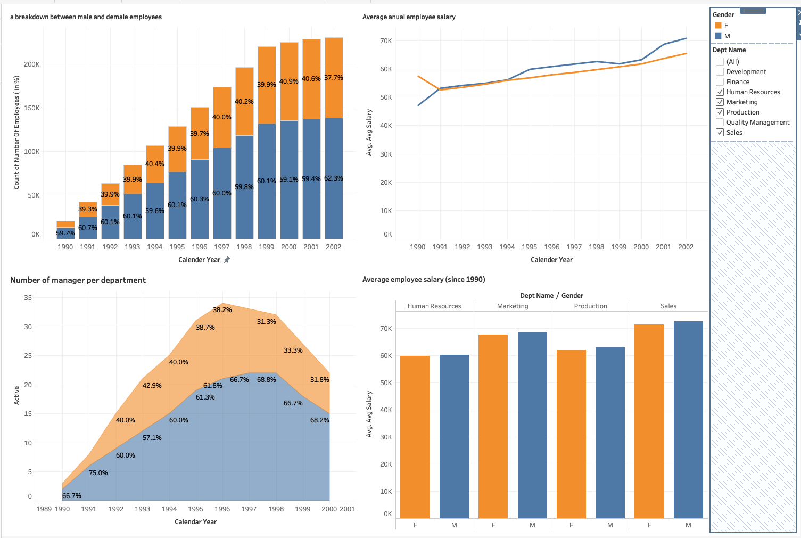

# employee_mysql_tableau_BI

Connect MySQL Database to Tableau Desktop to analyze employee data insights.

Business Questions:

* Q1: Create a visualization that provides a breakdown between the male and female employees working in the company each year, starting from 1990. 
* Q2: Compare the number of male managers to the numbers of female managers from different departments for each year, starting from 1990
* Q3: Compare the average salary of female versus male employees in the entire company until year 2002, and add a filter allowing you to see that per each department.
* Q4: Create an SQL stored procedure that will allow you to obtain the average male and female salary per department within a certain salary range. Let this range be defined by two values the user can insert when calling the procedure.

Pre-planning detal BI work procedure in "Project Design Instruction.txt"
Planning:

1. interprete business questions to be answered.
2. plan sql queries by referring to schedma
3. right down details in columns, record format, time series, group by, calculation
4. plan tableau visuazliation E.G Chat types, dimensions, filter, color, fond, calculation, size, dashboard planning

Preject Steps:

1. Use MySQL to query data table that answer related business questions (queries in Queried folder)
2. connect Tableau with employees database and read data from each queries.
3. Use Tableau to visualize charts that answer questions asked.

